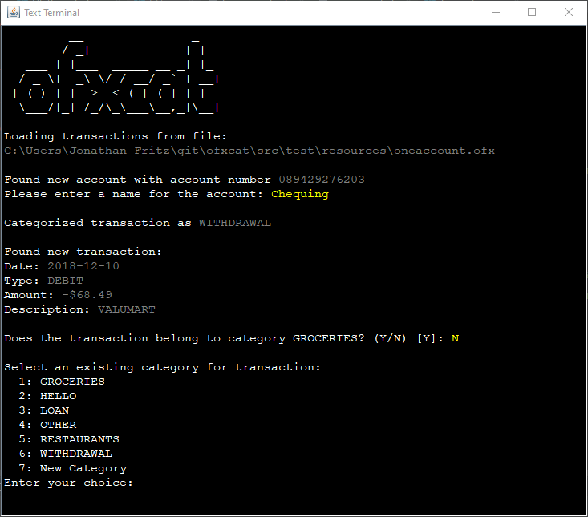

# ofxcat
A command line utility that imports bank transactions in `*.ofx` format and categorizes them.

## Building the application
To build ofxcat, you'll need the following software:
* git
* maven
* JDK 12+

Start by cloning the `master` branch of this repository:
```bash
git clone https://github.com/MusikPolice/ofxcat.git
cd ofxcat
```
Build with maven:
```bash
mvn clean install
```

## Importing Transactions
This utility can import any transactions that were exported from your banking institution in the Open Financial Exchange (OFX) format.

The method for exporting transactions differs between each banking institution, but in general, the goal is to download an `*.ofx` file that contains transactions from all of your accounts. 
 

Once you have exported your transactions, the `.ofx` file can be imported from the command line:
```bash
java -jar ofxcat-1.0-SNAPSHOT-jar-with-dependencies.jar --file mytransactions.ofx
``` 

`ofxcat` attempts to automatically categorize newly imported transactions based on their description (typically the name of the vendor that debited or credited your account).

If the transaction description is recognized, the tool will prompt you to approve the automatic categorization:


If the transaction description could fit into one of many categories, the tool will prompt you to choose the appropriate category:


If the transaction description does not match any existing categories, the tool will prompt you to enter the name of a new category for the transaction.

Transaction descriptions are compared using fuzzy string matching, allowing `ofxcat` to categorize transactions based on vendor names that differ only slightly.

For example, if you typically do groceries at Megamart #123, but occasionally visit Megamart #125, `ofxcat` will recognize that both transactions belong to the `GROCERIES` category.

## Contributing

### Adding support for a new institution
While most financial institutions are capable of exporting `*.ofx` files, the quality of the data in those files differs between institutions, and every bank produces data with particular quirks. 

ofxcat can import any valid `*.ofx` data, but will work better if that data is cleaned up before processing.

Out of the box, Royal Bank of Canada (RBC) is the only institution that is officially supported. If you bank with a different institution and want to add support for it to ofxcat, follow the steps below:

1. **Obtain an `*.ofx` file:** Before you can contribute, you'll need to figure out how to export some transactions from your financial institution. If you're already using ofxcat, you should be familiar with this process.
2. **Determine your institution's bankId:** Open the `*.ofx` file in a text editor and search for `<BANKID>`. The value to the right of this string is your bank's unique identifier. An `*.ofx` file from RBC contains the string `<BANKID>900000100`, so RBC's bankId is `900000100`.
3. **Implement a TransactionCleaner:** Fork the code and add an implementation of the [TransactionCleaner](https://github.com/MusikPolice/ofxcat/blob/master/src/main/java/ca/jonathanfritz/ofxcat/cleaner/TransactionCleaner.java) interface to the `ca.jonathanfritz.ofxcat.cleaner` package. Because the data from each bank is different, you'll need to play with exports from your bank and do some trial and error to figure out how best to massage the data in your `*.ofx` files. [RbcTransactionCleaner](https://github.com/MusikPolice/ofxcat/blob/master/src/main/java/ca/jonathanfritz/ofxcat/cleaner/RbcTransactionCleaner.java) provides a good example of the type of data transformation that you may want to do. 
4. **Submit a pull request:** Please make sure that your code follows the standards and formatting that you see elsewhere in the project, and that it is unit tested.   