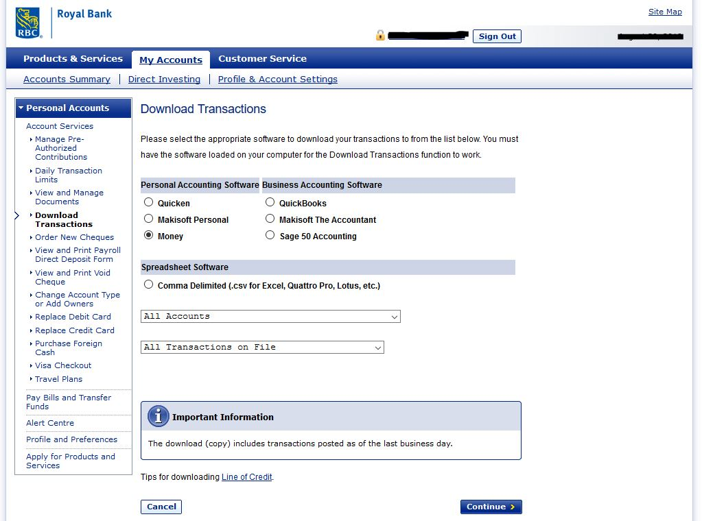
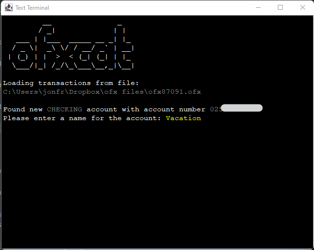
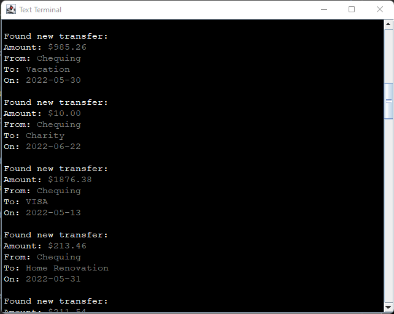
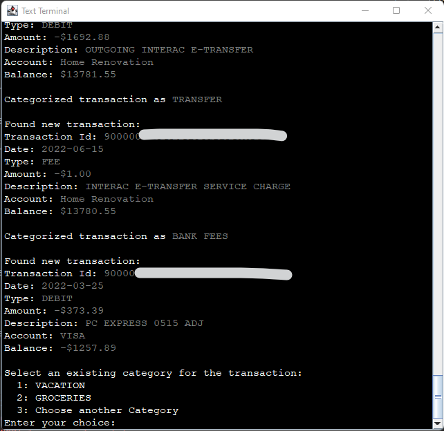

# ofxcat

[](https://github.com/MusikPolice/ofxcat/actions/workflows/build.yml)

A command line utility that imports bank transactions in the `*.ofx` format and categorizes them.

## Using the application
### Importing Transactions
This utility can import any transactions that were exported from your banking institution in the Open Financial Exchange (OFX) format.

The method for exporting transactions differs between each banking institution, but in general, the goal is to download an `*.ofx` file that contains transactions from all of your accounts.

On the website for my bank, the `*.ofx` format is referred to as "Money":


Once you have exported your transactions, the `.ofx` file can be imported with the `import` command:
```bash
java -jar ofxcat-<hash>.jar import mytransactions.ofx
``` 

`ofxcat` attempts to automatically categorize newly imported transactions based on their description (typically the name of the vendor that debited or credited your account).

#### Accounts
Each transaction belongs to exactly one account. Upon encountering an account for the first time, `ofxcat` will prompt you to give it a name:



#### Transfers
Transfers between recognized accounts will be detected and automatically together based on the amount transferred and date of transfer:



#### Categorizing Transactions
When a new transaction is found that is not recognized as an inter-account transfer, `ofxcat` attempts to categorize it using a four-tier strategy:

1. **Keyword rules:** The transaction description is normalized into tokens and matched against configurable rules in `~/.ofxcat/keyword-rules.yaml`. If a rule matches, the transaction is automatically categorized. This is useful for common merchants like Amazon, Starbucks, etc.
2. **Exact match:** `ofxcat` searches for previously imported transactions with the same description. If all exact matches belong to the same category, the new transaction is automatically added to that category.
3. **Token match:** If no exact match is found, `ofxcat` splits the description into tokens and searches for previously imported transactions with overlapping tokens. If matches are found, `ofxcat` asks if you would like to add the new transaction to one of the matching categories.
4. **Manual selection:** If none of the above strategies produce a match, `ofxcat` will allow you to choose from a list of all categories that it knows about, or to create a new category.



Because transaction descriptions are normalized into tokens before comparison, `ofxcat` can categorize transactions based on vendor names that differ only slightly. As an example, if you typically do groceries at Megamart #123 but decide to shop at Megamart #125 while visiting a different city, `ofxcat` will recognize the similarity in the transaction descriptions and offer to categorize the transaction from Megamart #125 as `GROCERIES`.

### Managing Categories

Over time, you may end up with duplicate or poorly named categories. `ofxcat` provides commands to fix this.

#### Combining Categories
To merge all transactions from one category into another:
```bash
java -jar ofxcat-<hash>.jar combine categories --source=DAYCARE --target="CHILD CARE"
```
This moves all transactions from DAYCARE to CHILD CARE, then deletes the DAYCARE category. If the target category doesn't exist, it will be created automatically.

#### Renaming a Category
The `rename` command is an alias for `combine` — it works exactly the same way:
```bash
java -jar ofxcat-<hash>.jar rename category --source=DAYCARE --target="CHILD CARE"
```

After a combine or rename, if any keyword rules in `keyword-rules.yaml` still reference the old category name, `ofxcat` will warn you and offer to update them automatically.

### Reports
Once you have categorized some transactions, you can find out where your money is going by looking at how much is spent per category over a given period of time:
```bash
java -jar ofxcat-<hash>.jar get transactions --start-date=2021-11-01 --end-date=2022-06-30
```
This returns a matrix with category names along the x-axis and months on the y-axis. The total amount spent in each category during each month appears in the table, followed by trailing average and summary rows:
```
MONTH, DAYCARE, GROCERIES, MORTGAGE, PETS, PROPERTY TAX, RESTAURANTS, SHOPPING, UTILITIES, VEHICLES, TOTAL
Nov-21,-1899.00,-696.87,-1557.10,0.00,-285.61,-464.26,-293.41,-359.00,-284.19,-5839.44
Dec-21,-1493.58,-1263.73,-1557.10,-347.12,-285.60,-387.78,-433.53,-503.82,-421.78,-6694.04
Jan-22,-1388.00,-1359.73,-1557.10,-121.83,-283.91,-279.55,-949.85,-689.56,-718.90,-7348.43
Feb-22,-1388.00,-850.85,-1557.10,-95.81,-283.91,-478.64,-546.00,-531.98,-290.87,-6023.16
Mar-22,-1388.00,-846.14,-1557.10,-130.82,-283.91,-257.83,-1073.06,-640.24,-400.83,-6577.93
Apr-22,-1388.00,-994.94,-2335.65,-148.79,-283.91,-508.28,-356.43,-542.49,-319.47,-6877.96
May-22,-1325.00,-708.81,-778.55,0.00,-283.91,-243.57,-609.19,-543.29,-1249.54,-5741.86
Jun-22,0.00,0.00,0.00,0.00,0.00,0.00,0.00,0.00,0.00,0.00
t3m,-904.33,-567.92,-1038.07,-49.60,-189.27,-250.62,-321.87,-361.93,-523.00,-4206.61
t6m,-1146.17,-793.41,-1297.58,-82.88,-236.59,-294.65,-589.09,-491.26,-496.60,-5428.23
avg,-1283.70,-840.13,-1362.46,-105.55,-248.85,-327.49,-532.68,-476.30,-460.70,-5637.85
total,-10269.58,-6721.07,-10899.70,-844.37,-1990.76,-2619.91,-4261.47,-3810.38,-3685.58,-45102.82
```
The report is printed as CSV to the terminal by default. To export directly to Excel, use the `--format xlsx` flag:
```bash
java -jar ofxcat-<hash>.jar get transactions --start-date=2021-11-01 --end-date=2022-06-30 --format=xlsx
```
This writes the report to `~/.ofxcat/reports/transactions-<start>-to-<end>.xlsx` and prints the path. To specify a different output location:
```bash
java -jar ofxcat-<hash>.jar get transactions --start-date=2021-11-01 --end-date=2022-06-30 --format=xlsx --output-file=~/Desktop/spending-report.xlsx
```

## Storage and Logging
`ofxcat` stores imported transactions in an SQLite3 database located in `~/.ofx/ofxcat.db`. Similarly, the log file is located at `~/.ofx/ofxcat.log`.

Due to the nature of the application, both files may include sensitive information about your transaction history, and should be appropriately protected.

### Getting Help
If you get stuck, check the docs:
```bash
java -jar ofxcat-<hash>.jar help
```
If that doesn't work, create an issue, and I'll do my best to help you out as soon as possible.

## Building the application
To build ofxcat, you'll need the following software:
* git
* JDK 21

Start by cloning the `master` branch of this repository:
```bash
git clone https://github.com/MusikPolice/ofxcat.git
cd ofxcat
```
Build with gradle:
```bash
./gradlew clean build shadowJar
```

A fat jar that contains the application and its dependencies will be created at `build/libs/ofxcat-<hash>.jar`, where `<hash>` is the first seven characters of the current git commit hash (e.g. `ofxcat-b29d4f1.jar`).
You can run the application with:
```bash
java -jar build/libs/ofxcat-$(git rev-parse --short=7 HEAD).jar
```

### Known Issues
When running the application, you may see a warning about unsafe method usage:
```bash
WARNING: A terminally deprecated method in sun.misc.Unsafe has been called
WARNING: sun.misc.Unsafe::objectFieldOffset has been called by com.google.common.util.concurrent.AbstractFuture$UnsafeAtomicHelper (file:/C:/Users/jonfr/Documents/GitHub/ofxcat/build/libs/ofxcat-<hash>.jar)
WARNING: Please consider reporting this to the maintainers of class com.google.common.util.concurrent.AbstractFuture$UnsafeAtomicHelper
WARNING: sun.misc.Unsafe::objectFieldOffset will be removed in a future release
WARNING: A restricted method in java.lang.System has been called
WARNING: java.lang.System::loadLibrary has been called by org.fusesource.hawtjni.runtime.Library in an unnamed module (file:/C:/Users/jonfr/Documents/GitHub/ofxcat/build/libs/ofxcat-<hash>.jar)       
WARNING: Use --enable-native-access=ALL-UNNAMED to avoid a warning for callers in this module
WARNING: Restricted methods will be blocked in a future release unless native access is enabled
```

This warning originates in the `com.google.guava` library, which is a transitive dependency of both guice and ofx4j:
```bash
com.google.guava:guava:31.0.1-jre
\--- com.google.inject:guice:7.0.0
     \--- runtimeClasspath

com.google.guava:guava:18.0 -> 31.0.1-jre
\--- org.reflections:reflections:0.9.10
     \--- com.webcohesion.ofx4j:ofx4j:1.39
          \--- runtimeClasspath
```
For now, the warning can be safely ignored. It should be fixed in subsequent releases of the affected libraries. More info is available [here](https://github.com/google/guava/issues/6806).

## Contributing

### Adding support for a new institution
While most financial institutions are capable of exporting `*.ofx` files, the quality of the data in those files differs between institutions, and every bank produces data with particular quirks. 

`ofxcat` can import any valid `*.ofx` data, but will work better if that data is cleaned up before processing.

Out of the box, Royal Bank of Canada (RBC) is the only institution that is officially supported. If you bank with a different institution and want to add support for it to ofxcat, follow the steps below:

1. **Obtain an `*.ofx` file:** Before you can contribute, you'll need to figure out how to export some transactions from your financial institution. If you're already using ofxcat, you should be familiar with this process.
2. **Determine your institution's bankId:** Open the `*.ofx` file in a text editor and search for `<BANKID>`. The value to the right of this string is your bank's unique identifier. An `*.ofx` file from RBC contains the string `<BANKID>900000100`, so RBC's bankId is `900000100`.
3. **Implement a TransactionCleaner:** Fork the code and add an implementation of the [TransactionCleaner](https://github.com/MusikPolice/ofxcat/blob/master/src/main/java/ca/jonathanfritz/ofxcat/cleaner/TransactionCleaner.java) interface to the `ca.jonathanfritz.ofxcat.cleaner` package. Because the data from each bank is different, you'll need to play with exports from your bank and do some trial and error to figure out how best to massage the data in your `*.ofx` files. [RbcTransactionCleaner](https://github.com/MusikPolice/ofxcat/blob/master/src/main/java/ca/jonathanfritz/ofxcat/cleaner/RbcTransactionCleaner.java) provides a good example of the type of data transformation that you may want to do. 
4. **Submit a pull request:** Please make sure that your code follows the standards and formatting that you see elsewhere in the project, and that it is unit tested.   